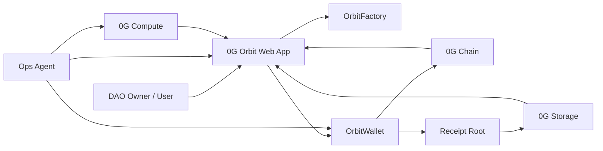

# 0G Orbit

0G Orbit is a self-custodial operational wallet for AI agents. It lets users and DAOs delegate bounded authority to autonomous agents without handing over private keys or unlimited spending power.

The project targets Track 3: Agentic Economy & Autonomous Applications, with a narrow focus on operational tools: self-custodial agent wallets, policy-gated execution, verifiable receipts, and optional risk attestations for high-risk actions.

## Submission One-Liner

0G Orbit gives AI agents a bounded wallet for approved operations, with policy-gated execution and verifiable receipts across 0G Chain, Storage, and Compute.

Word count: 21

## Short Summary

### What the project does

0G Orbit is a self-custodial operational wallet for AI agents. It lets a user or DAO define an execution envelope for an agent, including spending caps, allowlisted recipients, allowlisted selectors, cooldowns, and an emergency pause.

### Which problem it solves

Autonomous agents are useful, but giving them raw private keys or unlimited wallet access is unsafe. 0G Orbit turns agent autonomy into bounded authority: the agent can handle routine operations, while the contract enforces policy and rejects unsafe actions.

### Which 0G components are used

- 0G Chain: OrbitFactory and OrbitWallet deployment, on-chain policy-gated execution, explorer-visible activity.
- 0G Storage: receipt bundle upload and verifiable storage root for replayable audit.
- 0G Compute: provider discovery and compute-assisted risk attestation.

## Live Links

- Live demo: https://paradoxsch.github.io/0g-orbit/
- GitHub repository: https://github.com/paradoxSCH/0g-orbit
- Mainnet explorer: https://chainscan.0g.ai

## Core Thesis

Autonomous agents should not hold private keys. They should hold limited, revocable, auditable authority.

## What Reviewers Should Look For

1. The wallet owner defines the policy envelope once.
2. The agent can only execute inside that envelope.
3. Allowed operations succeed and unsafe ones are rejected.
4. Each operation is backed by chain, storage, and compute evidence.

## System Architecture



### Technical Description

- `OrbitFactory` deploys bounded `OrbitWallet` instances.
- `OrbitWallet` enforces per-transaction caps, daily caps, cooldowns, recipient allowlists, selector allowlists, and pause control.
- The UI simulates a DAO ops workflow where an agent proposes routine payments and renewals.
- Allowed actions produce explorer-visible transactions and receipt roots.
- Full receipt bundles are uploaded through 0G Storage.
- Risk review evidence is generated through 0G Compute provider discovery and attestation logic.

## MVP Demo Flow

1. A DAO owner creates a 0G Orbit wallet.
2. The owner funds the wallet and authorizes an Agent ID.
3. The owner defines policies: daily budget, per-transaction cap, allowed recipients, allowed function selectors, cooldowns, and risk rules.
4. An AI ops agent proposes actions such as paying a contractor, renewing a service, or calling an approved contract.
5. 0G Compute produces or validates the operation plan.
6. The wallet contract executes safe operations and rejects violations.
7. Each action emits an on-chain receipt hash and stores the full reasoning, invoice, policy snapshot, and result on 0G Storage.

## Which 0G Component(s) Does This Project Use?

- 0G Chain
- 0G Storage
- 0G Compute

The current public proof is built around these three components. Agent ID and privacy-oriented features are product extensions, but they are not the current proof anchor for submission.

## 0G On-Chain Integration Proof

### 0G Chain

- Network: 0G Mainnet
- Chain ID: `16661`
- Explorer: https://chainscan.0g.ai
- OrbitFactory: `0xDa6B1c6b391E7Aa1EAF8124Ce36523B274dac422`
- OrbitWallet: `0xE63503a61fafF1E0b57019849924818fA62Efa36`
- Allowed execution tx: `0xe0492e5b5debf0af5b330ca6edb582b90954f9e85bf2120c1f37c7d5c19f73fe`

Direct links:

- Factory: https://chainscan.0g.ai/address/0xDa6B1c6b391E7Aa1EAF8124Ce36523B274dac422
- Orbit wallet: https://chainscan.0g.ai/address/0xE63503a61fafF1E0b57019849924818fA62Efa36
- Execution tx: https://chainscan.0g.ai/tx/0xe0492e5b5debf0af5b330ca6edb582b90954f9e85bf2120c1f37c7d5c19f73fe

### 0G Storage

- Storage root: `0xa421435a8ea2bc5255fada6fba4e4a8b0d66f7a76bb5aa810432e51ad15151a1`
- Storage tx: `0xaf82f6add8fb89c82036399781485319e572fda7a7a201edf9a27ca7ed3ceac8`

### 0G Compute

- Provider discovery: `6` providers discovered through the 0G Compute SDK
- Risk attestation root: `0xf0d39b1f4c4c9ac78f8f4f90def666096ec0fcfd777b61e2153cd788e8d0c237`

## Hackathon Progress

- Product direction, interface, and interaction flow designed during the hackathon period.
- Solidity contracts implemented for OrbitFactory and OrbitWallet.
- Real wallet deployed on 0G Mainnet after Galileo validation.
- Allowed transaction executed on-chain on both Galileo and Mainnet.
- Receipt bundle uploaded through 0G Storage.
- Compute-based provider discovery and risk attestation generated through the 0G Compute SDK.
- Public demo site deployed through GitHub Pages.

## Deployment Status

Current submission-grade deployment proof is on 0G Mainnet. Galileo was used first for iteration and proof-of-flow; the same deployer then executed the production deployment on mainnet.

## Reviewer Notes

- Public demo link: https://paradoxsch.github.io/0g-orbit/
- Recommended review path: Hero -> Interactive Core -> Proof Stack -> System Picture.
- The repository includes the app, contracts, deploy script, storage upload script, compute attestation script, and GitHub Pages deployment workflow.
- Some development-only artifacts remain local and are gitignored, but the public repo keeps the demo functional and reviewable.
- Mainnet deployment record is stored at `deployments/mainnet.json` locally; public proof is linked above through ChainScan.

## Local Reproduction Steps

```bash
npm install
npm run dev
npm run typecheck
npm run build
npm run compile:contracts
npm run deploy:galileo -- --faucet-tx=<FAUCET_TX_HASH>
npm run deploy:mainnet
npm run storage:upload-receipt
npm run compute:attest-risk
```

Create a local Galileo test wallet:

```bash
npm run wallet:create
```

## Test Account / Faucet Notes

- The public 0G faucet currently serves Galileo Testnet: https://faucet.0g.ai/
- 0G Mainnet requires funded native `0G`; there is no public mainnet faucet in the current official docs.
- The local deployment flow expects a funded deployer wallet in `.env.local`.
- If judges only review the public demo, no wallet setup is needed.
- If judges want to replay deployment or storage upload, they should first fund a Galileo test wallet and then run the scripts above.
