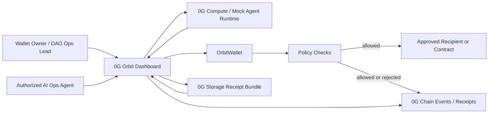

# Architecture

## System Overview



## Component Responsibilities

### Frontend Dashboard

- Shows wallet balance and status.
- Lets owner set policies.
- Lets agent propose or execute operations.
- Shows accepted and rejected operations.
- Displays receipt bundle and explorer links.

### Mock Agent Runtime

- Produces deterministic operation proposals for the demo.
- Generates human-readable reasoning.
- Marks operations as low, medium, or high risk.
- Can be replaced by 0G Compute-backed reasoning.

### OrbitWallet

- Holds funds.
- Stores owner and authorized agent.
- Executes only if policy checks pass.
- Emits events for all attempts.
- Supports emergency pause.

### Policy Checks

Minimum MVP checks:

- caller is authorized agent or owner.
- wallet is not paused.
- recipient is allowlisted.
- amount is below per-transaction cap.
- rolling spend is below daily cap.
- cooldown is satisfied.
- contract function selector is allowlisted for calls.

### Receipt Bundle

Stored on 0G Storage in final implementation. The receipt includes:

- operation request.
- policy snapshot.
- agent reasoning.
- result status.
- transaction hash if executed.
- rejection reason if blocked.

### 0G Chain

Used for:

- deployed wallet contracts.
- policy updates.
- execution or rejection events.
- receipt root references.
- authorized agent identity binding.

## Data Flow

### Allowed Operation

1. Owner configures policy.
2. Agent proposes operation.
3. Runtime produces reasoning and operation payload.
4. UI computes receipt draft and submits operation.
5. Wallet checks policy and executes.
6. UI finalizes receipt with tx hash.
7. Receipt is uploaded to 0G Storage.
8. Receipt root is recorded or linked on-chain.

### Rejected Operation

1. Agent proposes unsafe operation.
2. UI submits operation or simulates policy check.
3. Wallet rejects on-chain, or frontend precheck predicts rejection.
4. Receipt records rejection reason.
5. Audit bundle is stored for review.

## Contract Shape for MVP

```solidity
struct Operation {
    address to;
    uint256 value;
    bytes data;
    bytes32 receiptRoot;
}
```

Recommended events:

```solidity
event PolicyUpdated(address indexed wallet, bytes32 policyHash);
event AgentAuthorized(address indexed wallet, address indexed agent);
event OperationExecuted(address indexed wallet, address indexed agent, address indexed to, uint256 value, bytes32 receiptRoot);
event OperationRejected(address indexed wallet, address indexed agent, bytes32 receiptRoot, string reason);
```

## Risk-Attestation Stretch

For high-risk calls, add:

- `riskLevel` in operation payload.
- `riskAttestationHash` in receipt.
- `authorizedAuditorSigner` in wallet policy.
- ECDSA verification for high-risk execution.

This adds Track 2-style technical depth without turning the project into a trading bot.
